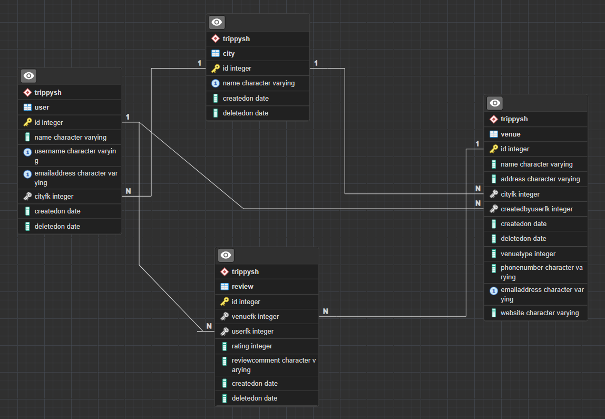

# Trippy Application
## Table of Content
- [Project Description](#project-description)
- [Technologies](#technologies)
- [Functionalities](#functionalities)
- [Tests](#tests)
- [Architecture of the project](#architecture-of-the-project)
- [ER Diagram of the database](#er-diagram-of-the-database)
- [API Documentation](#api-documentation)
- [Getting Started](#getting-started)

## Project Description
Trippy is Java application  that enables users to explore lists of hotels, bars, and restaurants in a city of their choosing,
or view all available options within the application. Each venue listed in the app includes comprehensive information,
such as its type, reviews, rating, and more. Additionally, any user can contribute by adding new venue,
which will then be visible to other users.
Moreover, the app allows users to leave reviews, add friends, and access public information of other users,
such as their usernames and join dates, fostering a social and interactive environment.
## Technologies
Project is created with:
* Java 11
* Spring Boot
* JUnit 4
* Maven
* Postgres
* JDBC
## Functionalities

#### City Management
`getAllCities()`: Retrieve a list of all cities available in the application. 
`getCityById(Integer id)`: Retrieve detailed information about a city based on its ID. 

#### Review Management
`getReviewsByVenueId(int venueId)`: Retrieve all reviews for a specific venue based on its ID. 
`getReviewById(int reviewId)`: Retrieve detailed information about a review based on its ID. 
`createReview(ReviewRequest reviewRequest, int venueId)`: Add a new review for a specific venue. 
`editReview(ReviewRequestUpdate reviewRequestUpdate, int reviewId, int userId)`: Edit an existing review with new information. 
`deleteReview(int reviewId, int userId)`: Delete a review.

#### User Management
`getAllUsers()`: Retrieve a list of all users registered in the application. 
`getUserById(int id)`: Retrieve detailed information about a user based on their ID. 
`getUserByUsername(String username)`: Retrieve a user by their username. 
`getUserByEmailAddress(String emailAddress)`: Retrieve a user by their email address. 
`createUser(UserRequest userRequest)`: Add a new user to the application.

#### Venue Management
`getAllVenues()`: Retrieve a list of all venues available in the application. 
`getVenuesFiltered(String type, int cityId, double rating)`: Retrieve filtered venues based on type, city, and rating. 
`getVenueById(int venueId)`: Retrieve detailed information about a venue based on its ID. 
`createVenue(VenueRequest venueRequest, int userId)`: Add a new venue to the application. 
`editVenue(VenueRequestUpdate venueRequestUpdate, int creatorId, int venueId)`: Edit an existing venue with new information.

## Tests
This project utilizes JUnit and Mockito for testing to thoroughly evaluate the application's functionality, including positive and negative scenarios, and exceptional cases.
The testing scope covered the controllers, mappers, services, and repositories for city, venue, user, and review components.
The testing efforts have resulted in a total of 52 tests.
The test coverage has achieved 57% coverage of lines and  the tests covered 74% of the classes
## Architecture of the project
The project follows a Three-Layer Architecture with distinct layers:

* Presentation Layer: Handles user interactions and displays information. (Controller)
* Service layer: Contains business logic and processes data. (Service)
* Data Layer: Manages data storage and retrieval. (Repository)
## ER Diagram of the database

## API Documentation
The base URL for all API endpoints is `http://localhost:8080`
### API Endpoints

| Short Description                         | Endpoint (URL)                                  | Method Type |
|-------------------------------------------|-------------------------------------------------|-------------|
| Get all cities                            | /cities                                         | GET         |
| Get reviews by venue ID                   | /venues/{venueId}/reviews                       | GET         |
| Create a review                           | /venues/{venueId}/reviews                       | POST        |
| Edit a review                             | /users/{userId}/reviews/{reviewId}              | PUT         |
| Delete a review                           | /users/{userId}/reviews/{reviewId}              | DELETE      |
| Get all users                             | /users                                          | GET         |
| Get a user by ID                          | /users/{id}                                     | GET         |
| Get a user by username                    | /users?username={username}                      | GET         |
| Get a user by email address               | /users?emailAddress={emailAddress}              | GET         |
| Create a user                             | /users                                          | POST        |
| Get all venues                            | /venues                                         | GET         |
| Create a venue                            | /users/{userId}/venues                          | POST        |
| Edit a venue                              | /users/{userId}/venues/{venueId}                | PUT         |
| Get filtered venues by type, city, rating | /venues?type={type}&city={city}&rating={rating} | GET         |
## Getting Started

To run Trippy Application on your local system, follow these instructions:

* Clone the repository: git clone https://github.com/milosheskasimona/trippy-application.git
* Navigate to the project directory: cd trippy
* Install dependencies: npm install
* Configure the database: Ensure a compatible database is set up and modify the configuration file accordingly.  
  DDL Script for the database is located at: src/main/resources/trippyDDL.sql  
  Also you need to set up properties for the database at: src/main/resources/application-postgre.properties
* Start the application: npm start
* Access the application in your browser at http://localhost:8080.

